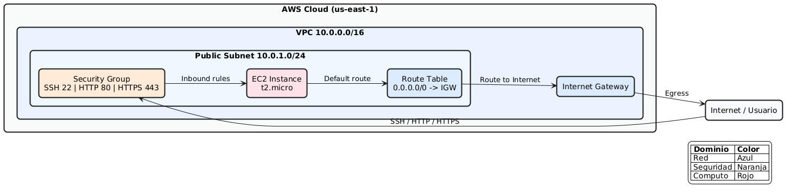
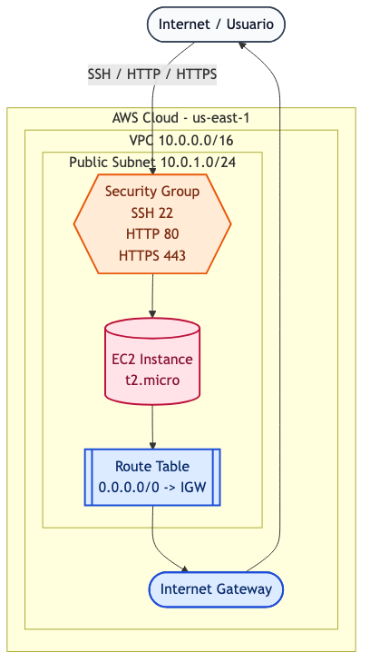

# Terraform AWS - Infraestructura modular con EC2


Este repositorio aprovisiona una infraestructura base en AWS usando Terraform y una arquitectura por módulos.

El despliegue crea:

- Una VPC.
- Una subred pública.
- Un Internet Gateway.
- Una tabla de rutas con salida a Internet.
- La asociación de tabla de rutas a la subred.
- Un Security Group con reglas para SSH, HTTP y HTTPS.
- Una instancia EC2 en subred pública.

## Quick Start

Onboarding rapido en menos de 5 minutos:

1. Configura tus credenciales AWS:

```bash
aws configure
```

2. Inicializa Terraform en la raiz del proyecto:

```bash
terraform init
```

3. (Opcional pero recomendado) formatea y valida:

```bash
terraform fmt -recursive
terraform validate
```

4. Genera y revisa el plan:

```bash
terraform plan -out=tfplan
```

5. Aplica la infraestructura:

```bash
terraform apply tfplan
```

6. Consulta la IP publica de la instancia:

```bash
terraform output public_ip
```

## Objetivo del proyecto

Proveer una base simple, clara y reutilizable para desplegar una instancia EC2 con conectividad pública, separando cada componente de red y cómputo en módulos independientes.

## Tecnologías usadas

- Terraform.
- Provider AWS de Terraform.
- AWS (VPC, Subnet, Route Table, Internet Gateway, Security Group, EC2).
- AWS CLI (para autenticación y validación local).

## Arquitectura (alto nivel)

Flujo de dependencias principal:

1. VPC.
2. Subnet (depende de VPC).
3. Internet Gateway (depende de VPC).
4. Route Table (depende de VPC e Internet Gateway).
5. Asociación Route Table <-> Subnet.
6. Security Group (depende de VPC).
7. EC2 (depende de Subnet y Security Group).

## Estructura del repositorio

```
.
├── main.tf
├── variables.tf
├── outputs.tf
└── modules
        ├── 1-vpc
        ├── 2-subnet
        ├── 3-security-groups
        ├── 4-ec2_instance
        ├── 5-internet_gateway
        └── 6-route_table
```

Descripción rápida:

- `main.tf`: Orquesta módulos y recursos de asociación.
- `variables.tf`: Variables de entrada globales.
- `outputs.tf`: Salidas principales del despliegue.
- `modules/*`: Implementación desacoplada por dominio de infraestructura.

## Requisitos

Antes de ejecutar:

- Terraform instalado (recomendado: versión reciente estable).
- AWS CLI instalado y configurado.
- Credenciales AWS válidas con permisos para crear recursos de red y EC2.
- Una cuenta de AWS activa.

Opcional recomendado:

- `terraform fmt` y `terraform validate` en tu flujo local.

## Configuración

### 1) Credenciales de AWS

Configura credenciales con AWS CLI:

```bash
aws configure
```

También puedes usar perfiles:

```bash
export AWS_PROFILE=tu-perfil
```

### 2) Región

La región está definida en `main.tf` actualmente como `us-east-1`.

Si deseas otra región, actualízala en el bloque `provider "aws"`.

### 3) Variables del proyecto

Variables principales disponibles en `variables.tf`:

- `vpc_cidr` (default: `10.0.0.0/16`)
- `subnet_cidr` (default: `10.0.1.0/24`)
- `availability_zone` (default: `us-east-1a`)
- `ami_id` (default definido en el repositorio)
- `instance_type` (default: `t2.micro`)
- `ssh_port` (default: `22`)
- `http_port` (default: `80`)
- `https_port` (default: `443`)
- `ssh_ip` (default definido en el repositorio; cámbialo por tu IP)
- `ec2_connect_ips` (rango permitido para EC2 Instance Connect)
- `all_traffic_cidr` (default: `0.0.0.0/0`)

### 4) Archivo terraform.tfvars (recomendado)

Crea un archivo `terraform.tfvars` para sobreescribir valores sin tocar `variables.tf`:

```hcl
vpc_cidr          = "10.0.0.0/16"
subnet_cidr       = "10.0.1.0/24"
availability_zone = "us-east-1a"
instance_type     = "t2.micro"
ssh_ip            = "TU_IP_PUBLICA/32"
all_traffic_cidr  = "0.0.0.0/0"
```

## Cómo ejecutar

En la raíz del proyecto:

1. Inicializar:

```bash
terraform init
```

2. Formatear y validar:

```bash
terraform fmt -recursive
terraform validate
```

3. Revisar plan:

```bash
terraform plan -out=tfplan
```

4. Aplicar infraestructura:

```bash
terraform apply tfplan
```

## Salidas del despliegue

El proyecto expone, entre otras, estas salidas en `outputs.tf`:

- `vpc_id`
- `subnet_id`
- `igw_id`
- `route_table_id`
- `security_group_id`
- `instance_id`
- `public_ip`

Para consultarlas:

```bash
terraform output
```

## Cómo destruir la infraestructura

Cuando quieras eliminar todo lo creado:

```bash
terraform destroy
```

## Costos estimados

Estimación orientativa para us-east-1 (puede variar por fecha, región, consumo y tipo de cuenta):

| Recurso | Configuración estimada | Costo mensual aprox. |
|---|---|---:|
| EC2 | 1 x t2.micro (On-Demand) | ~USD 8 - 10 |
| EBS | Volumen raíz gp2/gp3 pequeño (8-10 GB) | ~USD 0.8 - 1.2 |
| Transferencia de datos | Tráfico saliente variable | Depende del uso |
| VPC/Subnet/Route Table/IGW/SG | Componentes base de red | USD 0 (sin NAT Gateway) |
| **Total base estimado** | **Sin considerar free tier ni alto tráfico** | **~USD 9 - 12 / mes** |

Notas:

- Si tu cuenta aplica al AWS Free Tier y mantienes los límites, el costo puede ser cercano a USD 0.
- El mayor impacto suele venir de transferencia de datos, almacenamiento y recursos adicionales no contemplados.
- Para validación exacta, utiliza AWS Pricing Calculator antes de pasar a entornos productivos.

## Evidencias

Se recomienda adjuntar evidencias visuales para PR y portfolio:

### Arquitectura AWS (actual)



### Arquitectura AWS (alternativa portfolio)



- Captura de la salida de terraform plan.
- Captura de terraform apply exitoso.
- Captura de terraform output public_ip y/o salida completa.
- Diagrama o captura de la arquitectura desplegada en AWS.

Plantilla sugerida:

```md
### 1) Plan de Terraform


### 2) Apply exitoso


### 3) Outputs de infraestructura


### 4) Arquitectura AWS


### 5) Arquitectura AWS (alternativa)

```

## Buenas prácticas y seguridad

- No subas archivos `.tfvars` con secretos al repositorio.
- Mantén `ssh_ip` restringido a tu IP pública real en formato `/32`.
- Revisa costos de recursos antes de aplicar en cuentas productivas.
- Considera usar backend remoto para estado en equipos (S3 + DynamoDB lock).

## Solución de problemas

- Error de credenciales AWS:
    - Verifica `aws sts get-caller-identity`.
- Error por AMI inválida en región:
    - Ajusta `ami_id` a una AMI existente en la región configurada.
- Error de zona/subred:
    - Alinea `availability_zone` con la región activa.
- No puedes conectarte por SSH:
    - Revisa `ssh_ip`, reglas del Security Group y método de acceso de la AMI.

## Mejoras sugeridas para evolución

- Parametrizar la región (hoy está fija en el provider).
- Definir versiones mínimas de Terraform y provider AWS en un archivo `versions.tf`.
- Añadir backend remoto para estado compartido.
- Incorporar una instancia en subred privada + NAT Gateway para escenarios más realistas.
